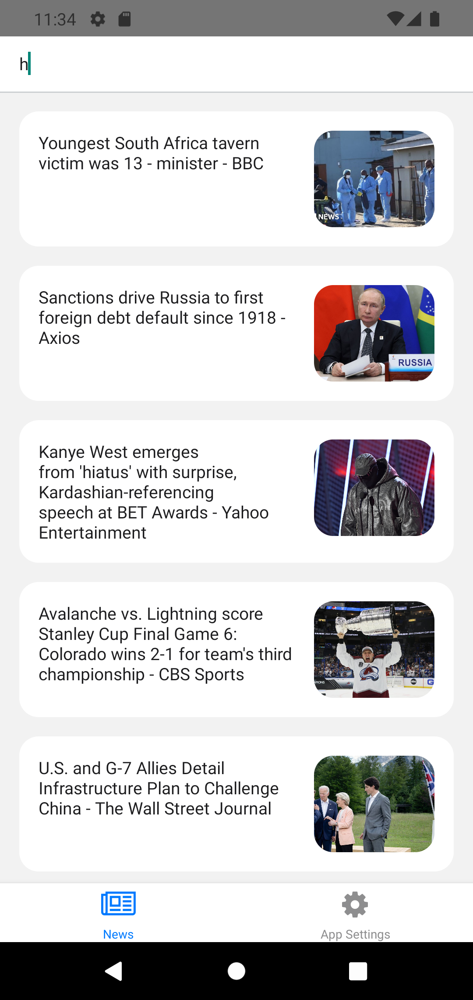
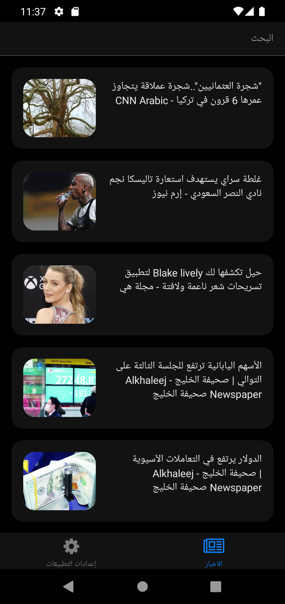
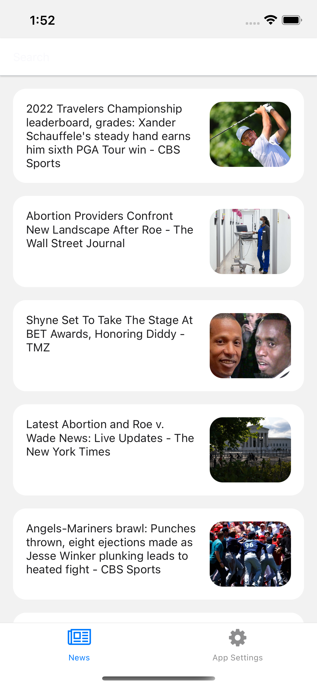
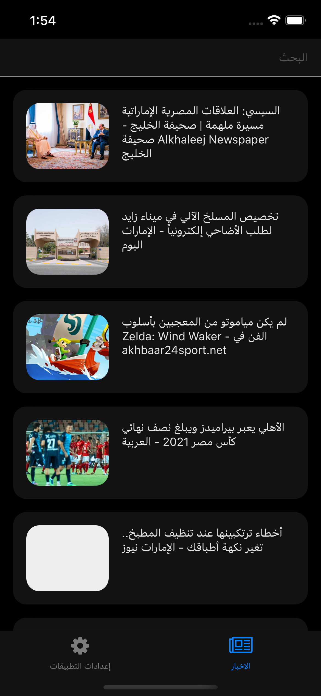

## About
Mobile application that displays the news and have the ability to search and change app language.

## Setup
First clone this Repo and run the following command:
`yarn` or `npm install`.

To run on iOS use `nmp run ios` and for android use `npm run android`.

## About News API
Search worldwide news with code

Locate articles and breaking news headlines from news sources and blogs across the web with our JSON API

Example API:
* https://newsapi.org/v2/everything?q=tesla&from=2022-05-27&sortBy=publishedAt&apiKey=8bc009adec3c42edb2a6730a085bcc67

## React-Native Packages Used  
    "@react-native-async-storage/async-storage": "^1.17.7",
    "@react-navigation/bottom-tabs": "^6.3.1",
    "@react-navigation/native": "^6.0.10",
    "@react-navigation/native-stack": "^6.6.2",
    "@reduxjs/toolkit": "^1.8.2",
    "axios": "^0.27.2",
    "i18next": "^21.8.10",
    "moment": "^2.29.3",
    "react": "18.0.0",
    "react-i18next": "^11.17.2",
    "react-native": "0.69.0",
    "react-native-restart": "^0.0.24",
    "react-native-safe-area-context": "^4.3.1",
    "react-native-screens": "^3.13.1",
    "react-native-vector-icons": "^9.2.0",
    "react-redux": "^8.0.2"
    
## Screenshots
Android:

iOS:

